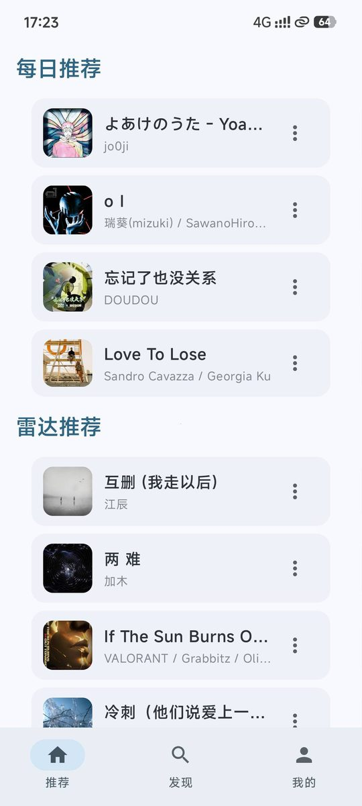
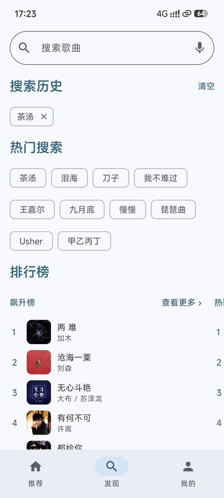
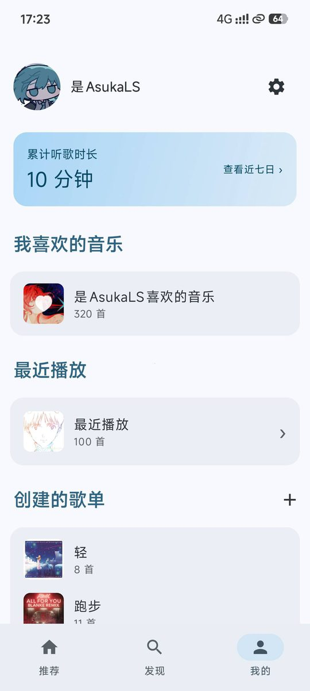
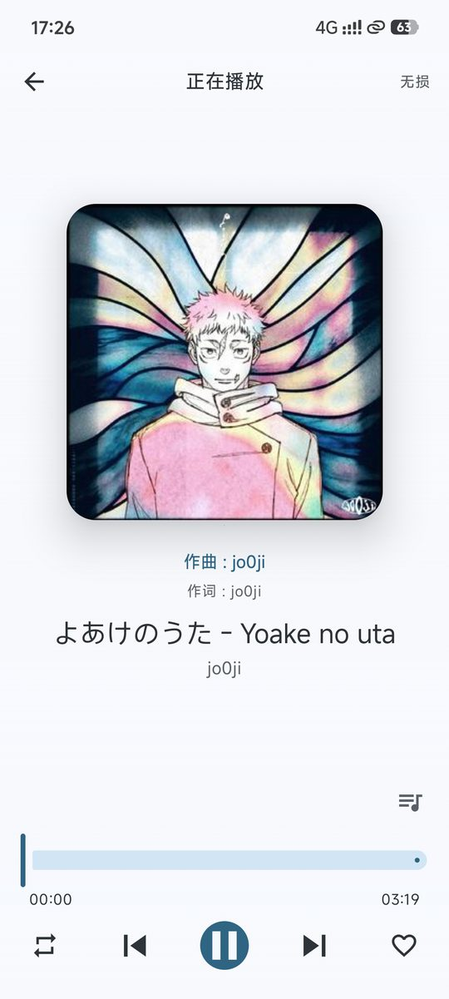

<div align="center">

# 🎵 云音 NCMusic

**极简 · 轻量的网易云音乐第三方 Android 客户端**

使用 Jetpack Compose + Material 3 构建 · 支持 Android 12+ 莫奈动态取色 🎨

[](#-构建运行)
[](#-技术栈)
[](#-技术栈)
[](#-技术栈)
[](LICENSE)

[✨ 功能特性](#-功能特性) · [📸 界面预览](#-界面预览) · [🚀 构建运行](#-构建运行) · [⚠️ 免责声明](#️-免责声明)

</div>

---

## 📸 界面预览

| 🏠 推荐 | 🔍 发现 | 👤 我的 | ▶️ 播放 |
| :---: | :---: | :---: | :---: |
|  |  |  |  |
| 每日推荐 · 雷达推荐 | 搜索历史 · 热搜 · 排行榜 | 我喜欢的 · 最近播放 · 歌单 | 播放器 · 歌词 · 进度控制 |

---

## ✨ 功能特性

### 🔐 三种登录方式

| 方式 | 说明 |
| :--- | :--- |
| 📱 **扫码登录** | 手机网易云音乐 App 扫码确认，无需输入密码 |
| ☎️ **手机号登录** | 支持「密码登录 / 验证码登录」二级切换 |
| 🍪 **Cookie 登录** | 可靠性最高，从网页端复制 Cookie 粘贴即可 |

### 🎧 播放能力

- 🎼 基于 **Media3 ExoPlayer**，后台播放 + 通知栏控制（下一曲/上一曲完整支持）
- 🎚 音质切换：标准 / 较高 / 极高 / 无损 FLAC / Hi-Res / 超清母带
- 🔁 播放模式：顺序 · 列表循环 · 单曲循环 · 随机
- 📜 播放队列 · 定时关闭 · MiniPlayer 左右滑动切歌
- 🎵 本地音乐扫描与播放

### 📝 歌词系统

- 🎬 **全屏滚动歌词**，随进度高亮与自动滚动
- 🪟 **桌面悬浮歌词**：透明无背景、可自由拖动、自定义颜色与字号、支持锁定位置
- ✨ 当前行高亮加粗 + 下一行半透明预览

### 🎛 音效增强

- 📈 **10 段可视化均衡器** —— 直接在曲线上拖动调节
- 🔊 响度增强（统一不同歌曲响度）· 音量增益
- 🔌 USB 独占输出 · 硬解 / 软解切换

### 🎨 界面

- 🌈 Material 3 设计语言 + **莫奈动态取色**（Material You）
- 🎨 18 种自定义主题色 · 🌗 跟随系统 / 浅色 / 深色
- 💫 播放页从底部滑入动画 · 正在播放歌曲跳动指示器

### 🔍 内容浏览

- 📅 每日推荐 · 🎯 个性化歌单 · 📡 雷达推荐
- 🏆 官方排行榜（飙升榜 / 热歌榜 / 原创榜 / 新歌榜）
- 🔎 搜索（热搜 · 搜索历史 · 歌单内搜索）
- 💚 歌单收藏 · 歌手详情页

> 🧹 **已裁剪**（去冗余）：评论、动态、云盘、MV、签到、关注、私信、付费点播等。

---

## 🛠 技术栈

| 分类 | 技术 |
| :--- | :--- |
| 🧩 **语言** | Kotlin 2.3.21 |
| 🎨 **UI** | Jetpack Compose（BOM 2026.04.01）+ Material 3 + 莫奈动态取色 |
| 🌐 **网络** | OkHttp + KotlinX Serialization（**无 Retrofit**，直连官方接口） |
| 🖼 **图片** | Coil（比 Glide 更轻、更 Compose 友好） |
| ▶️ **播放** | Media3 ExoPlayer + MediaSessionService（前台服务） |
| 💾 **存储** | DataStore Preferences（替代 Room，减少依赖） |
| 🔨 **构建** | AGP 8.13.0 · Gradle 8.14.3 · compileSdk/targetSdk 36 · minSdk 24 · JDK 17 |

---

## 🚀 构建运行

1. 📥 用 **Android Studio**（Hedgehog 或更新版本）打开本目录
2. ⏳ 等待 Gradle Sync 完成（首次会下载依赖）
3. 📱 连接真机或启动模拟器（Android 8.0+ 建议，Android 12+ 体验莫奈取色）
4. ▶️ 点击 Run 运行

> 💡 **提示**：请将项目放在**不含空格**的路径下（如 `D:\NCMusic`），部分 Gradle 任务对空格路径敏感。

---

## 🌐 网络实现

项目**直连网易云官方接口**（`https://music.163.com`），不依赖任何第三方中转服务。

| 模块 | 位置 | 说明 |
| :--- | :--- | :--- |
| 🔐 请求加密 | `core/network/crypto/WeapiCrypto.kt` | weapi 加密（AES-CBC 双层 + RSA） |
| 📡 接口调用 | `core/network/direct/DirectApi.kt` | 优先明文通道，必要时回退 weapi |
| 📦 数据解析 | `data/model/` | KotlinX Serialization 数据类 |

> ⚠️ 由于使用**非公开接口**，接口可能随时变更导致部分功能失效。若某功能异常，通常是官方接口调整所致，而非应用 Bug。

---

## 🔑 登录说明

登录页提供三种方式（顶部标签切换）：

| 方式 | 说明 |
| :--- | :--- |
| 📱 **扫码登录** | 使用手机网易云音乐 App 扫码确认，无需输入密码 |
| ☎️ **手机号登录** | 支持「密码登录 / 验证码登录」二级切换；可能触发官方风控 |
| 🍪 **Cookie 登录** | **可靠性最高**。从浏览器已登录的网页端复制完整 Cookie（需含 `MUSIC_U`）粘贴即可 |

> 🔒 **Cookie 等同于账号凭证**，请勿分享给他人，也不要在不可信环境粘贴。
>
> 🛡 登录凭证仅保存在本机 DataStore（应用私有目录），**不会上传到任何服务器**。

---

## 📁 目录结构

```
app/src/main/java/com/buddy/ncmusic/
├── 🚀 NCMusicApp.kt           # Application，恢复登录态
├── 🚪 MainActivity.kt         # 入口 Activity
├── 🌐 core/network/           # 加密、直连接口、Cookie 注入
├── 📦 data/
│   ├── model/                 # DTO（@JsonNames 兼容多接口字段差异）
│   ├── repository/            # 数据仓库
│   └── local/                 # DataStore 登录态 / 设置
├── ▶️ playback/               # ExoPlayer 管理器、前台服务、桌面歌词
├── 🎨 ui/
│   ├── theme/                 # MD3 + 莫奈取色
│   ├── navigation/            # 导航图 + 底部导航
│   ├── components/            # 通用组件（歌曲项 / 歌单卡 / MiniPlayer）
│   └── screens/               # 首页 / 发现 / 我的 / 播放 / 设置 / 均衡器 …
└── 🧰 util/                   # 歌词解析、结果封装、二维码生成
```

---

## 🗺 后续计划

- [ ] 🎤 私人 FM / 心动模式
- [x] 🌐 双语歌词（原词 + 翻译）
- [x] 💾 本地缓存与离线播放
- [ ] 💿 播放页封面临摹（黑胶唱片旋转动画）
- [x] 🎚 音质设置持久化

---

## ⚠️ 免责声明

**本项目为个人学习与技术研究项目，与网易云音乐官方无任何关联。**

1. 🚫 **用途限制**：仅供学习交流与技术研究，**严禁用于任何商业用途**。
2. 📀 **数据来源**：所有音乐数据与版权内容均来源于网易云音乐，版权归原平台及权利人所有。本项目**不存储、不分发任何音乐文件**，仅作为客户端展示。
3. 🔧 **接口风险**：项目使用非公开接口，存在稳定性与合规风险，使用者需自行承担。
4. 🔐 **账号安全**：请勿在不可信环境登录账号。因使用本项目导致的账号异常、数据丢失等后果，作者不承担责任。
5. 📮 **权利响应**：如权利人认为本项目侵犯其合法权益，请通过 Issue 联系，将**立即配合删除或调整**。

> 🌍 若你所在地区或平台不允许此类项目存在，请勿使用或分发本项目。

---

## 📄 开源许可

本项目采用 **GNU General Public License v3.0 (GPL-3.0)** 授权，许可全文见 [LICENSE](LICENSE)。

这意味着你可以自由使用、修改、分发本项目，但需遵守以下义务：

- 🔄 若分发本项目或其**衍生作品**，必须同样以 **GPL-3.0** 授权开源
- 📤 必须向接收者提供**完整源代码**（包括你的修改）
- ©️ 必须保留原始版权声明与许可文本
- 📝 修改后的版本需**注明改动内容**
- ⛔ 不得附加 GPL 之外的额外限制

```
Copyright (C) 2026 Canelé (3399185897)

This program is free software: you can redistribute it and/or modify
it under the terms of the GNU General Public License as published by
the Free Software Foundation, either version 3 of the License, or
(at your option) any later version.

This program is distributed in the hope that it will be useful,
but WITHOUT ANY WARRANTY; without even the implied warranty of
MERCHANTABILITY or FITNESS FOR A PARTICULAR PURPOSE.  See the
GNU General Public License for more details.
```

> 🙏 第三方开源组件及其许可，已在应用内「设置 → 关于 → 开源许可」中列明（均为 Apache-2.0）。

---

<div align="center">

**⭐ 如果这个项目对你有帮助，欢迎点个 Star 支持一下！**

Made with ❤️ by [Canelé](https://github.com/3399185897)

</div>
